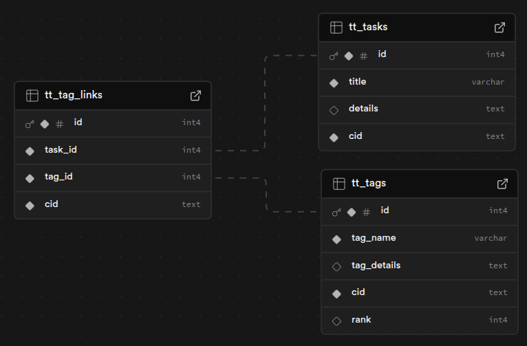

# TagTodo

A simple task management app that organises tasks using tags

Designed for mobile devices, offers a simple uncluttered interface for easy task management.

App name: **TagTodo**

### User stories:

- As a user I want a secure login system to protect my data.
- As a user I want to have clean navigation.
- As a user I want to create tasks.
- As a user I want to edit tasks.
- As a user I want to delete tasks.
- As a user I want to tasks to have a title and description.
- As a user I want to tag a task with one or more tags.
- As a user I want to view all tasks ordered based on tags.
- As a user I want to create new tags.
- As a user I want to edit existing tags.
- As a user I want to Delete existing tags.
- As a user I want to tag to have a title and description.
- As a user I want to change a tags importance.

---

#### Wire frames


Navigation Bar (Always Visible)

- Profile
- Full screen Toggle
- Dark/Light mode Toggle
- New Task Opens task editor form
- View Tasks Shows list of Tasks (with tag filter panel) selecting tag opens task editor
- View Tags Show list of Tags - selecting tag enables edit/delete/view all(tasks)

Content area (one of the following)

- Not logged in will show message to sign in
- Task Editor
- Tag Editor
- Task list
- Tag list

Footer (always visible)

- copyright

---

#### database schema



- tt\_ A unique prefix for multi use database
- tt_tasks the tasks, with title and text
- tt_tags the tags, with title and details
- tt_tag_links, the tag links table used to link a tag to a task

All three have a cid column, this holds the owners clerk id.

While the tasks and title have identical columns it is expected that the tasks will be expanded later and this separation of data will avoid confusion.

---

#### Project layout

The project uses nextjs, pg, and clerk, accessing a supabase.com database.

##### installation

You should be familiar with supabase.com and clerk.com and have an account with both, your system should have node and npm installed and working before using this software.

Clone the repository:

```bash
    git clone git@github.com:Ivovis/TagTodo.git
```

Install dependencies:

```bash
   cd TagTodo
   npm install
```

Copy or rename example.env.local to env.local
edit env.local replacing the angle brackets with the variables listed within them.

Create the tables in the database:

```bash
    node seed.js
```

Run the app:

```bash
    npm run dev
```

Navigate to http://localhost:3000
