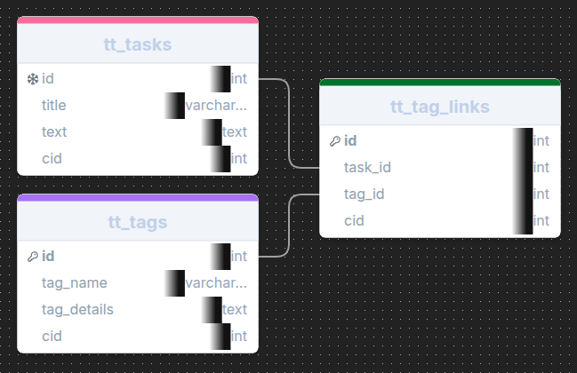

# TagTodo

A simple task management app that organises tasks using tags

Designed for mobile devices, offers a simple uncluttered interface for easy task management.

App name: **TagTodo**

### User stories:

- As a user I want a secure login system to protect my data.
- As a user I want to have clean navigation.
- As a user I want to create tasks.
- As a user I want to tag a task with one or more tags.
- As a user I want to view all tasks.
- As a user I want to view all tasks with selected tag or tags.
- As a user I want to edit an existing task.
- As a user I want to delete a task.
- As a user I want to Create new tags.
- As a user I want to Edit existing tags.
- As a user I want to Delete existing tags.

---

#### Wire frames

Navigation Bar (Always Visible)

- Profile
- Full screen Toggle
- Dark/Light mode Toggle
- New Task Opens task editor form
- View Tasks Shows list of Tasks (with tag filter panel) selecting tag opens task editor
- View Tags Show list of Tags - selecting tag enables edit/delete/view all(tasks)

Content area (one of the following)

- Not logged in will show message to sign in
- Task Editor
- Tag Editor
- Task list
- Tag list

Footer (always visible)

- copyright
- faux social media links

---

#### database schema

- tt\_ unique prefix for multi use database
- tt_tasks the tasks, with title and text
- tt_tags the tags, with title and details
- tt_tag_links, the tag links table used to link a tag to a task

While the tasks and title have identical columns it is expected that the tasks will be expanded later and this separation of data will avoid confusion.

---

#### Project layout

The project uses a vite based client and express server, accessing a supabase.com database and clerk based authentication solution.

To be deployed on render.com
